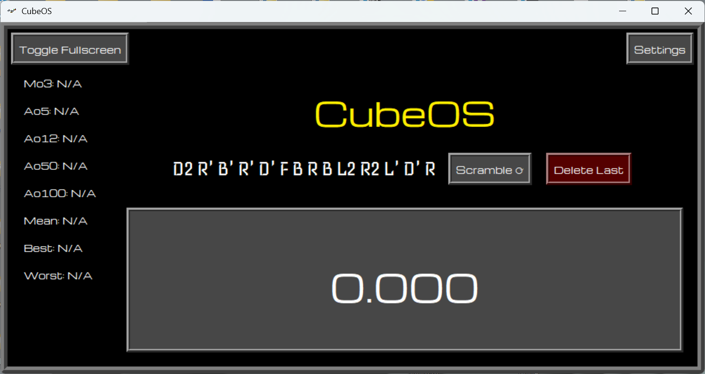
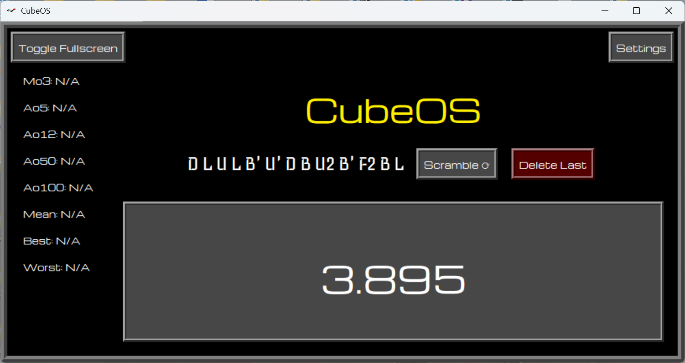
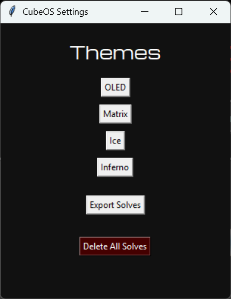
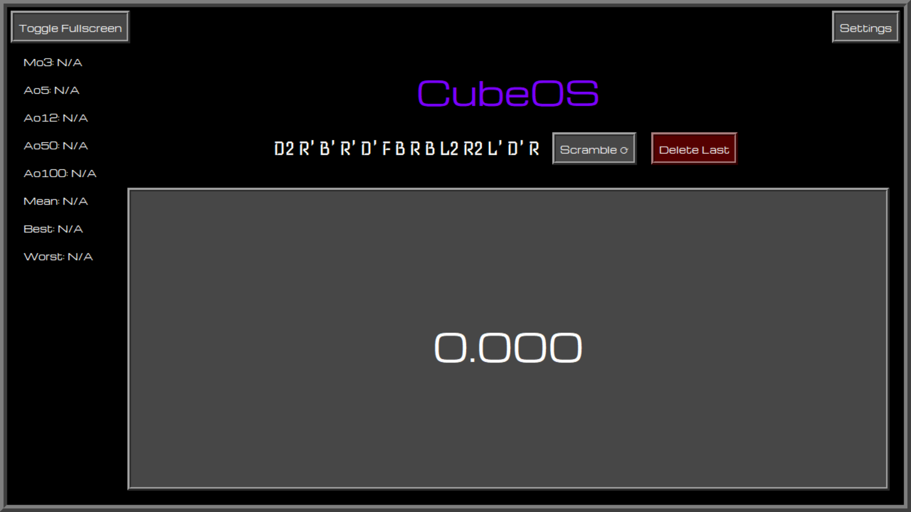

# CubeOS 🧊

CubeOS is a modern Rubik’s Cube timer application made with Python and Tkinter.

## Features

* Live timer with millisecond precision
* Realistic scramble generation
* Mo3 / Ao5 / Ao12 / Ao50 / Ao100 statistics
* Mean calculation
* Best and worst solve tracking
* RGB animated title
* Multiple built-in themes
* Fullscreen support
* Export solves
* Delete solve system
* Persistent save storage using `times.txt`

## Built With

* Python
* Tkinter
* PyInstaller

## Screenshots

### Main Menu


### Timer Running


### Themes


### Fullscreen Mode


## How To Run

### Python Version

Run:

```bash
python CubeOS.py
```

### EXE Version

Open:

```text
CubeOS.exe
```

## Creator

Made by HydroPixel i.e. Aliasgar.
